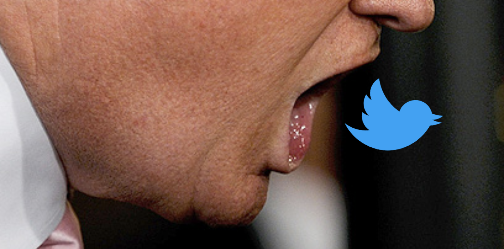

# Training SVM and Naive Bayes classifiers to identify presidential tweets from their content, with a dash of NLP and sentiment analysis (Sad!).

  

Can Donald Trump's tweets be identified from their content alone?  We'll train some cross-validated classifiers to identify Trump tweets the same way an e-mail spam filter sorts spam from ham. 

